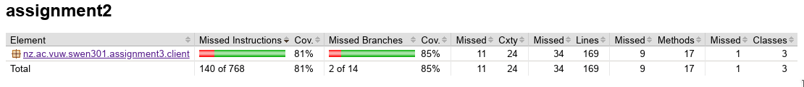
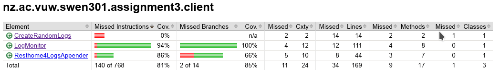
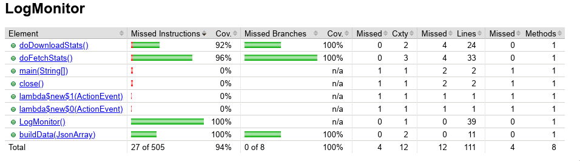
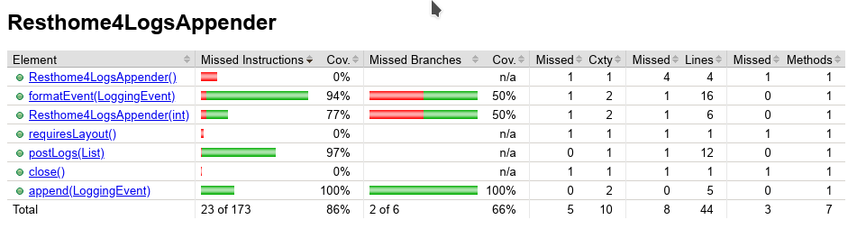
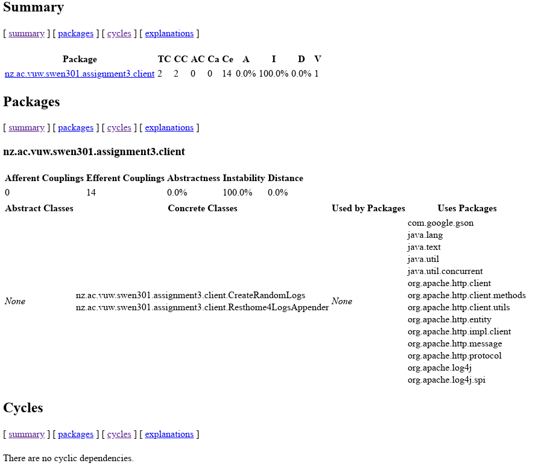

# assignment3-client Report

## Creating executables

Some classes have the ability to be packaged into standalone executable .jar files.
To generate these files type "mvn package" into the terminal.

### LogMonitor

To run the LogMonitor navigate to /target and type "java -jar LogMonitor.jar".
This will open the GUI.

### CreateRandomLogs

To run CreateRandomLogs navigate to /target and type "java -jar CreateRandomLogs.jar".

## JaCoCo Test Coverage

My testing class has a total coverage of 81% This is pretty good but it definitely could be better with more vigorous testing.

CreateRandomLogs has 0% coverage because I did not test it. I did not think it was necessary to test this class
because it is simply calling on Resthome4LogsAppender's functionality so by testing that I was confident
CreateRandomLogs would work. Also createRandomLogs runs indefinitely which could cause complications in my testing class.

I managed to get quite high coverage for my GUI clas LogMonitor. I attained this by running the GUI and calling it's methods
before closing it. This tested that its functions could be called upon without a fatal error crashing it and causing the
test to fail.

My Resthome4LogsAppender attained a reasonably high coverage of 86%. The uncovered sections include a constructor 
that sets the cache size to 10 and edge cases such as if a negative number is passed as the constructors parameter.
## JDepend Analysis

My softwares jDepend report is shown above. Here we can see I used 14 packages and 0 packages were reliant on my software.
This is a reasonable amount as most of them came from the same organisation, apache. My code has no cycles which is very
good as these are dangerous.

## Spotbugs Analysis

The spotbugs plugin previously highlighted bugs around unhandled exceptions
and unsafe closing / not closing IO streams. After some changes the tool is now showing no bugs.